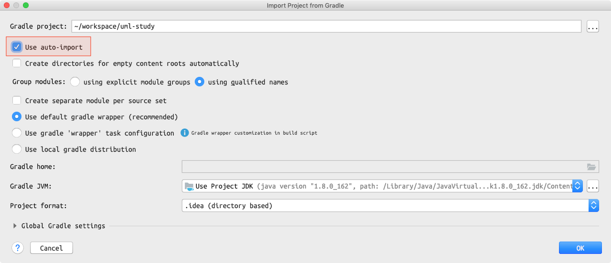
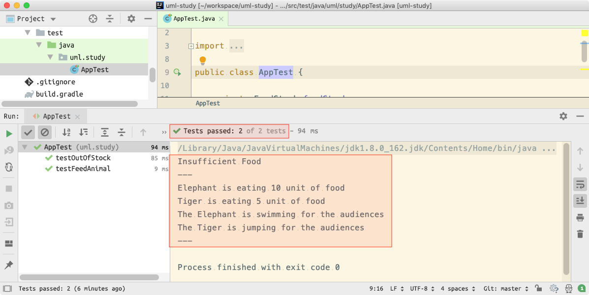

## UML Study

동물원 이야기입니다.

- 동물원에는 다수의 사육사(`ZooKeeper`)와 다양한 종류의 동물(`Animal`)들이 있습니다.
- 각 사육사는 담당하는 동물들이 있으며, 자신의 담당 동물들에게 먹이를 주는 책임이 있습니다.
- 동물원에 먹이 재고(`FoodStock`)는 한정되어 있습니다. 물론 재충전이 가능합니다.
- 먹이를 먹은 동물들은 관람객들을 위해 각자의 재주를 보여줍니다.

일반적으로 UML로 먼저 상위 설계를 진행하고, 하위 설계(프로그래밍)을 합니다. 

반면, 여기서는 UML에 익숙해 지는 것이 목적이므료, 구현 결과물을 보고 1) 클래스 다이어그램, ~~2) 시퀀스 다이어그램, 3) 액티비티 다이어그램~~을 그려 봅니다.

### Java dev env setup

```bash
$ brew cask install java8 

$ java -version
# java version "1.8.0_162"

$ export JAVA_HOME=$(/usr/libexec/java_home -v 1.8)
$ echo $JAVA_HOME
# /Library/Java/JavaVirtualMachines/jdk1.8.0_162.jdk/Contents/Home 
```

### Clone & Open Project

```bash
$ git clone git@github.com:appkr/uml-study.git && cd uml-study

~/uml-study $ idea build.gradle
```



### Run Test

- Open `src/test/java/uml/study/AppTest.java`
- Press <kbd>Ctrl</kbd>+<kbd>Shift</kbd>+<kbd>r</kbd>



### Reference

다이어그램 위주로 보실 것을 권장합니다.

- [FULL PDF "UML distilled 3rd edition" by Martin Fowler](http://ce.sharif.edu/courses/96-97/2/ce418-1/resources/root/Books/UMLDistilled.pdf)  
- [번역서 구매 좌표](http://www.yes24.com/Product/Goods/1810885)
- http://www.nextree.co.kr/p6753/
